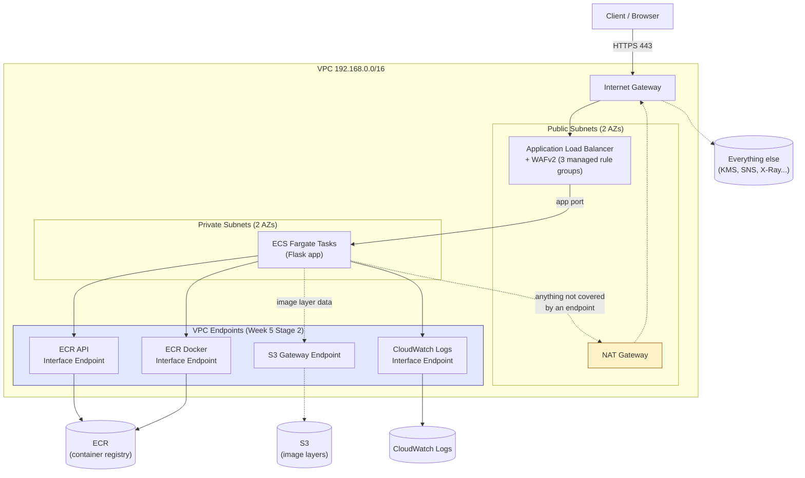

DevSecOps Project – Week 5 (CDK)
Progressive Delivery: Rollback, Network Isolation, Tracing, Blue/Green
Overview

This is the CDK port of the Terraform sibling's Week 5 —
[`devsecops-bootcamp/weeks/week-05-progressive-delivery/README.md`](https://github.com/adenoch1/devsecops-bootcamp/blob/main/weeks/week-05-progressive-delivery/README.md).
Same 4 stages, same reasoning, ported after each stage is validated on the
Terraform side. This is also the **first `weeks/` folder in this repo** —
until now, this repo was documented as one continuous port rather than a
week-by-week series. Going forward, every week gets its own folder here
too, mirroring the Terraform sibling, so both repos can be studied stage
by stage side by side.

Stage 1 — Rollback Parity (ECS Deployment Circuit Breaker)

**No new code this stage** — `EcsStack` already had
`circuit_breaker=ecs.DeploymentCircuitBreaker(rollback=True)` on its
`FargateService`, added earlier while porting the ECS stack (a cdk-nag
recommendation at the time). The Terraform sibling was actually the one
catching up here. See `cdk/stacks/ecs_stack.py`, the `FargateService`
construct in `EcsStack`.

Stage 2 — VPC Endpoints

What changed: `cdk/stacks/network_stack.py` adds a Gateway endpoint for S3
(free — ECR image layers are actually fetched from S3 under the hood, so
this covers image pulls too) and 3 Interface endpoints (`ECR` API,
`ECR_DOCKER`, `CLOUDWATCH_LOGS`) in the private subnets, behind a
dedicated security group scoped to the VPC CIDR — same reasoning as the
Terraform side: `EcsStack`'s task security group depends on `NetworkStack`'s
VPC output, so scoping the endpoint SG to it here would invert the stack
dependency.

**Same honest cost note as the Terraform side**: at 2 AZs and 3 interface
endpoints, this likely costs as much or more per month than the single NAT
gateway it doesn't replace. Security-posture improvement, not a cost win,
at this scale.

**A CDK-specific gotcha found while building this** (worth knowing if you
hit the same thing): `vpc.add_interface_endpoint(..., security_groups=[sg])`
does *not* stop there by default — CDK's `open` parameter defaults to
`True`, which makes it *also* add its own "allow from VPC CIDR" ingress
rule on top of whatever security group you supplied, using
`Fn::GetAtt Vpc.CidrBlock` (a CloudFormation intrinsic reference) rather
than a plain string. That duplicate rule is harmless functionally — same
traffic, expressed two ways — but cdk-nag's `AwsSolutions-EC23` check
can't statically analyze a non-primitive CIDR value and throws a
`CdkNagValidationFailure` instead of a real pass/fail. Fix: pass
`open=False` whenever you're already managing the endpoint's security
group yourself.

Solid arrows: traffic that now stays inside the VPC via an endpoint.
Dashed arrows: traffic that still goes out through the NAT gateway
(anything not covered by one of the 3 interface endpoints or the S3
gateway endpoint yet).

What Was Achieved in Week 5 (Stages 1–2)

✔ ECS deployment circuit breaker with automatic rollback (already present,
  confirmed and documented this stage)
✔ S3 gateway endpoint + 3 interface endpoints (ECR API, ECR Docker
  registry, CloudWatch Logs)
✔ Dedicated, VPC-scoped security group for the interface endpoints
✔ `weeks/` documentation convention established in this repo, matching the
  Terraform sibling

What's Next – Week 5 Stages 3–4

APM via AWS X-Ray: SDK instrumentation in the Flask app (`app/app.py` —
independent copy from the Terraform sibling's, needs the same change
applied twice), an X-Ray daemon sidecar in `EcsStack`'s task definition,
and IAM permissions for the task role to write trace segments.

CodeDeploy Blue/Green: a second target group in `EcsStack`, linear traffic
shifting, and the existing `ObservabilityStack` alarms (`AppErrorRateAlarm`,
`Alb5xxAlarm`) wired as automatic-rollback triggers *during* the shift.
