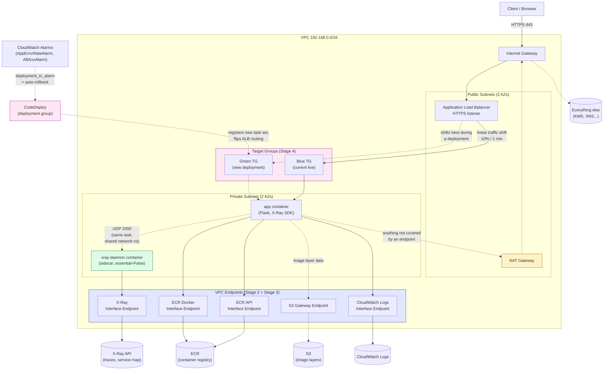

DevSecOps Project – Week 5 (CDK)
Progressive Delivery: Rollback, Network Isolation, Tracing, Blue/Green
Overview

This is the CDK port of the Terraform sibling's Week 5 —
[`devsecops-bootcamp/weeks/week-05-progressive-delivery/README.md`](https://github.com/adenoch1/devsecops-bootcamp/blob/main/weeks/week-05-progressive-delivery/README.md).
Same 4 stages, same reasoning, ported after each stage is validated on the
Terraform side. This is also the **first `weeks/` folder in this repo** —
until now, this repo was documented as one continuous port rather than a
week-by-week series. Going forward, every week gets its own folder here
too, mirroring the Terraform sibling, so both repos can be studied stage
by stage side by side.

Stage 1 — Rollback Parity (ECS Deployment Circuit Breaker)

**No new code this stage** — `EcsStack` already had
`circuit_breaker=ecs.DeploymentCircuitBreaker(rollback=True)` on its
`FargateService`, added earlier while porting the ECS stack (a cdk-nag
recommendation at the time). The Terraform sibling was actually the one
catching up here. See `cdk/stacks/ecs_stack.py`, the `FargateService`
construct in `EcsStack`.

Stage 2 — VPC Endpoints

What changed: `cdk/stacks/network_stack.py` adds a Gateway endpoint for S3
(free — ECR image layers are actually fetched from S3 under the hood, so
this covers image pulls too) and 3 Interface endpoints (`ECR` API,
`ECR_DOCKER`, `CLOUDWATCH_LOGS`) in the private subnets, behind a
dedicated security group scoped to the VPC CIDR — same reasoning as the
Terraform side: `EcsStack`'s task security group depends on `NetworkStack`'s
VPC output, so scoping the endpoint SG to it here would invert the stack
dependency.

**Same honest cost note as the Terraform side**: at 2 AZs and 3 interface
endpoints, this likely costs as much or more per month than the single NAT
gateway it doesn't replace. Security-posture improvement, not a cost win,
at this scale.

**A CDK-specific gotcha found while building this** (worth knowing if you
hit the same thing): `vpc.add_interface_endpoint(..., security_groups=[sg])`
does *not* stop there by default — CDK's `open` parameter defaults to
`True`, which makes it *also* add its own "allow from VPC CIDR" ingress
rule on top of whatever security group you supplied, using
`Fn::GetAtt Vpc.CidrBlock` (a CloudFormation intrinsic reference) rather
than a plain string. That duplicate rule is harmless functionally — same
traffic, expressed two ways — but cdk-nag's `AwsSolutions-EC23` check
can't statically analyze a non-primitive CIDR value and throws a
`CdkNagValidationFailure` instead of a real pass/fail. Fix: pass
`open=False` whenever you're already managing the endpoint's security
group yourself.

Solid arrows: traffic that now stays inside the VPC via an endpoint.
Dashed arrows: traffic that still goes out through the NAT gateway
(anything not covered by one of the 4 interface endpoints or the S3
gateway endpoint), or the app-to-daemon UDP link, which never leaves the
task's own network namespace at all.

Stage 3 — APM / Distributed Tracing via AWS X-Ray

What changed: three pieces, wired together.

1. `app/app.py` (independent copy from the Terraform sibling's — this
   exact change was applied twice, once per repo) — `aws-xray-sdk` added
   to `requirements.txt`; `XRayMiddleware` wraps the Flask app, recording
   a segment for every request via `xray_recorder.configure(daemon_address=...,
   context_missing="LOG_ERROR")`. `LOG_ERROR` instead of the SDK's default
   (which raises) so a missing trace context — a local run with no daemon,
   a background thread — logs a warning instead of crashing a request.
2. `cdk/stacks/ecs_stack.py` — `TaskDefinition.add_container` gains a
   second container, `xray-daemon` (`public.ecr.aws/xray/aws-xray-daemon`,
   UDP 2000, `essential=False`). The `app` container gets
   `add_container_dependencies(ContainerDependency(container=xray_container,
   condition=START))` so it doesn't start racing the daemon, plus an
   `AWS_XRAY_DAEMON_ADDRESS=127.0.0.1:2000` env var — `127.0.0.1` works
   because Fargate's `awsvpc` mode gives every container in the task one
   shared network namespace, same as `localhost` between processes on one
   host.
3. Still `ecs_stack.py` — `ecs_task_role` (previously empty, just a trust
   policy) gets an inline policy via `add_to_policy()` granting exactly
   what the daemon calls: `xray:PutTraceSegments`, `PutTelemetryRecords`,
   and the three `GetSampling*` reads the SDK polls for its sampling
   rules. All five require `Resource: "*"` — the X-Ray API has no
   resource-level ARNs to scope to, matching the Terraform sibling's
   `xray_write` policy document exactly.

Why `essential=False` on the daemon: if X-Ray's daemon crashes or can't
reach its endpoint, that should never be a reason the whole task cycles
and traffic drops. Tracing is an observability nice-to-have layered on top
of a working app, not a dependency the app's availability rides on.

VPC endpoint: `cdk/stacks/network_stack.py`'s interface-endpoint loop
gains a fourth entry, `XRayEndpoint` (`InterfaceVpcEndpointAwsService.XRAY`).
Same reasoning as Stage 2 — without it, the daemon's calls to the X-Ray
API would go out via the NAT gateway, the exact path Stage 2 exists to
avoid for everything else.

cdk-nag note: the new IAM5 finding on `EcsTaskRole/DefaultPolicy` (the
`Resource: "*"` X-Ray grant) is covered by the same stack-wide
`add_stack_suppressions` call already documenting the execution role's
`ecr:GetAuthorizationToken` finding — its reason text was updated to
describe both sources rather than adding a second suppression call, per
the KNOWN ISSUE noted in `ecs_stack.py` (per-resource suppressions don't
reliably stick in this cdk-nag version, stack-wide does).

Stage 4 — CodeDeploy Blue/Green

What changed: `cdk/stacks/ecs_stack.py` gains a second target group
(`green_target_group`, identical shape to the existing `target_group`).
`FargateService` drops `circuit_breaker=ecs.DeploymentCircuitBreaker(rollback=True)`
(Stage 1) in favor of `deployment_controller=ecs.DeploymentController(type=CODE_DEPLOY)`,
and also drops the `min_healthy_percent`/`max_healthy_percent` rolling-
update settings — both meaningless once CodeDeploy, not ECS's own
controller, owns the rollout. `cdk/stacks/observability_stack.py` gains
the actual CodeDeploy resources: `codedeploy.EcsApplication` +
`codedeploy.EcsDeploymentGroup`, referencing `EcsStack`'s service and both
target groups plus this stack's own `AppErrorRateAlarm`/`Alb5xxAlarm` —
living here for the same cross-stack-wiring reason the Terraform
sibling's equivalent lives at the env level rather than inside the `ecs`
module.

Traffic shift and rollback are configured identically to the Terraform
sibling: `CodeDeployDefault.ECSLinear10PercentEvery1Minutes` (referenced
by name — CDK has no named constant for the canary/linear predefined AWS
configs, only `ALL_AT_ONCE`; `EcsDeploymentConfig.from_ecs_deployment_config_name`
is how you reference a predefined one), `auto_rollback` enabled for both
`failed_deployment` and `deployment_in_alarm`, `alarms=[app_error_rate_alarm,
alb_5xx_alarm]`, and `termination_wait_time=Duration.minutes(5)` with no
manual continue-deployment gate — full automation, no on-call human to
gate on.

**The most interesting difference from the Terraform port, and worth
understanding well**: the Terraform sibling needed
`lifecycle.ignore_changes` on *both* the ECS service (`task_definition`,
`load_balancer`) *and* the ALB listener (`default_action`) — missing the
listener one caused a real production outage that session (a later
`terraform apply` reset the listener back to Terraform's stale config,
undoing what CodeDeploy had legitimately done). **Neither is needed here,
for two different reasons**:

1. CloudFormation has documented, built-in special-case behavior for
   `AWS::ECS::Service` with `DeploymentController.Type=CODE_DEPLOY` — it
   does not try to reconcile `TaskDefinition`/`LoadBalancers` on stack
   updates, full stop. This part has a direct Terraform analogue
   (`ignore_changes`), just implemented natively instead of manually.
2. The listener has no CloudFormation equivalent of `ignore_changes` —
   and doesn't need one, because CloudFormation change sets are computed
   by diffing the new template against CloudFormation's *own stored
   record* of the last-deployed template, not by re-reading the listener's
   *live* AWS state first. Terraform's `-refresh=true` plan step does read
   live state first — that refresh is exactly what saw CodeDeploy's
   change as "drift" and "corrected" it, causing the outage. CloudFormation
   has nothing to notice here in the first place; "drift detection" is a
   separate, manually-invoked CloudFormation feature precisely because
   this isn't automatic. Same end result (the listener survives
   redeployment untouched), structurally different reason — a genuinely
   interesting difference between the two tools' change-management models,
   not just a syntax difference.

cdk-nag note: `EcsDeploymentGroup` auto-creates its CodeDeploy service
role with the AWS-managed `AWSCodeDeployRoleForECS` policy, flagged
IAM4 — suppressed with the same reasoning already used for the ECS task
execution role's managed policy (AWS's own documented standard for this
exact purpose).

What Was Achieved in Week 5 (all 4 stages)

✔ ECS deployment circuit breaker with automatic rollback (Stage 1),
  superseded by CodeDeploy's stronger, alarm-aware rollback (Stage 4)
✔ S3 gateway endpoint + 4 interface endpoints (ECR API, ECR Docker
  registry, CloudWatch Logs, X-Ray)
✔ Dedicated, VPC-scoped security group for the interface endpoints
✔ Flask app instrumented end-to-end with AWS X-Ray, daemon sidecar
  isolated from app availability via `essential=False`
✔ Least-privilege X-Ray IAM policy on the task role (5 actions, no
  managed policy)
✔ Real CodeDeploy blue/green traffic shifting, alarm-gated automatic
  rollback wired to the Week 4 alarms — full parity with the Terraform
  sibling's live-verified Stage 4, including a documented explanation of
  why the two tools' change-management models handle the listener
  differently
✔ `weeks/` documentation convention established in this repo, matching the
  Terraform sibling

Week 5 is complete in both repos.
